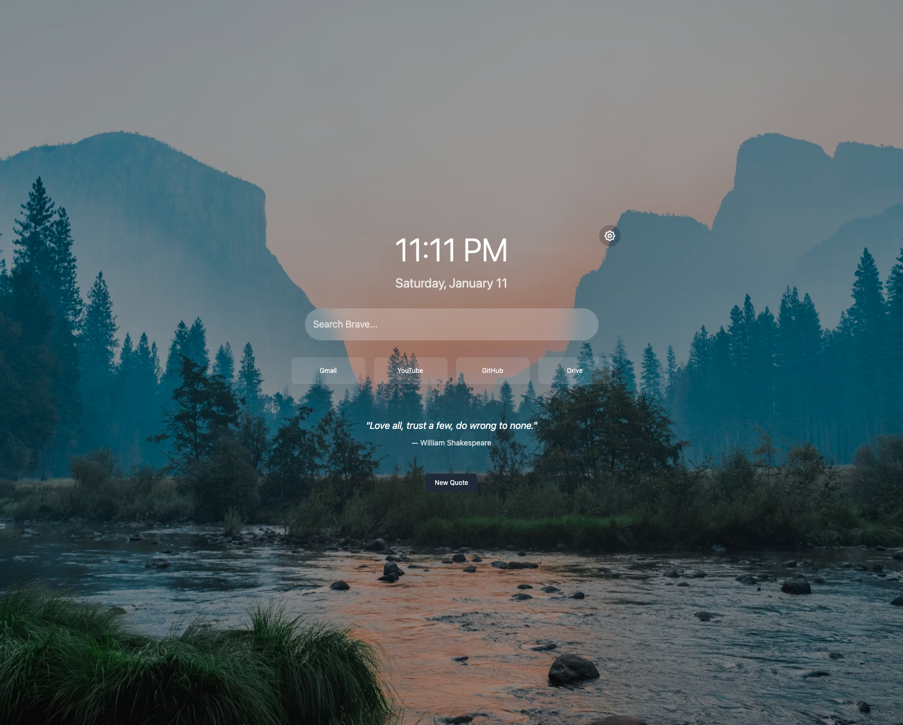

# Janus

Your Gateway to a Purposeful Web - A modern, customizable new tab page for Chrome built with React, TypeScript, and Tailwind CSS.



## Features

- Custom search functionality
- Quick links management
- Time display
- Inspirational quotes
- Clean, minimal interface

## Prerequisites

- Node.js (v16 or higher)
- npm (v8 or higher)
- Google Chrome browser

## Development

1. Clone the repository:
```bash
git clone git@github.com:ysenarath/janus.git
cd janus
```

2. Install dependencies:
```bash
npm install
```

3. Start the development server:
```bash
npm run dev
```

This will start a local development server at `http://localhost:5173` where you can preview the extension.

## Building and Installing in Chrome

1. Build the extension:
```bash
npm run build
```

This will create a `dist` directory containing the built extension files.

2. Load the extension in Chrome:
   - Open Chrome and navigate to `chrome://extensions`
   - Enable "Developer mode" in the top right corner
   - Click "Load unpacked"
   - Select the `dist` directory from your project folder

The extension will now replace your new tab page. Any time you make changes to the code:
1. Run `npm run build` again
2. Go to `chrome://extensions`
3. Click the refresh icon on your extension's card

## Project Structure

```
janus/
├── src/                    # Source code
│   ├── components/         # React components
│   ├── App.tsx            # Main application component
│   ├── main.tsx           # Application entry point
│   └── index.css          # Global styles
├── icons/                  # Extension icons
├── manifest.json           # Chrome extension manifest
├── vite.config.ts         # Vite configuration
└── tailwind.config.js     # Tailwind CSS configuration
```

## Contributing

Feel free to open issues and pull requests for any improvements you'd like to add.

## License

See the [LICENSE](LICENSE) file for details.
